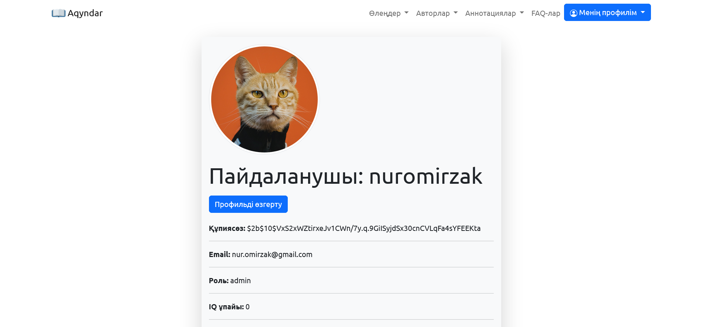

<div id="top"></div>
<!--
*** Thanks for checking out the Best-README-Template. If you have a suggestion
*** that would make this better, please fork the repo and create a pull request
*** or simply open an issue with the tag "enhancement".
*** Don't forget to give the project a star!
*** Thanks again! Now go create something AMAZING! :D
-->

<!-- https://github.com/othneildrew -->

<!-- PROJECT SHIELDS -->

<!--
*** I'm using markdown "reference style" links for readability.
*** Reference links are enclosed in brackets [ ] instead of parentheses ( ).
*** See the bottom of this document for the declaration of the reference variables
*** for contributors-url, forks-url, etc. This is an optional, concise syntax you may use.
*** https://www.markdownguide.org/basic-syntax/#reference-style-links
-->

[![Contributors][contributors-shield]][contributors-url][![Forks][forks-shield]][forks-url][![Stargazers][stars-shield]][stars-url][![Issues][issues-shield]][issues-url][![MIT License][license-shield]][license-url][![LinkedIn][linkedin-shield]][linkedin-url]

<!-- PROJECT LOGO -->

<br />
<div align="center">
  <a href="https://github.com/nuromirzak/aqyndar">
    
  </a>

<h3 align="center">Aqyndar</h3>

  <p align="center">
    Қазақстан жазушыларының және ақындарының поэемаларын түсінікті тілде жеткізу
    <br />
        <a href="https://github.com/nuromirzak/aqyndar"><strong>Документацияны оқу »</strong></a>
    <br />
    <br />
    <a href="https://aqyndar.herokuapp.com/">Сайтты ашу</a>
    ·
    <a href="https://github.com/nuromirzak/aqyndar/issues">Қате туралы хабарлау</a>
    ·
    <a href="https://github.com/nuromirzak/aqyndar/issues">Өзгеріс ұсыну</a>
  </p>
</div>

<!-- TABLE OF CONTENTS -->

<details>
  <summary>Мазмұн</summary>
  <ol>
    <li>
      <a href="#жоба-туралы">About The Project</a>
      <ul>
        <li><a href="#қолданылған-құралдар">Қолданылған құралдар</a></li>
      </ul>
    </li>
    <li>
      <a href="#проектке-кірісу">Проектке кірісу</a>
      <ul>
        <li><a href="#алғышарттар">Алғышарттар</a></li>
        <li><a href="#орнату">Орнату</a></li>
      </ul>
    </li>
    <li><a href="#үлесқосу">Үлес қосу</a></li>
    <li><a href="#лицензия">Лицензия</a></li>
    <li><a href="#контакттер">Контакттер</a></li>
  </ol>
</details>

<!-- ABOUT THE PROJECT -->

## حول المشروع

<table>
  <tr>
    <td valign="top" colspan="2"></td>
  </tr>
  <tr>
    <td valign="top"></td>
    <td valign="top"></td>
  </tr>
</table>

الغرض من هذا الموقع هو نقل قصائد الكتاب والشعراء الكازاخيين إلى الجمهور بلغة مفهومة. هذه
يعتمد المشروع على مبادئ التعهيد الجماعي. يساهم الأشخاص طواعية في القصائد / التعليقات التوضيحية على الموقع.

<p align="right">(<a href="#top">жоңарыға көтерілу</a>)</p>

### الأدوات المستخدمة

-   [![Express][Express.js]][Express-url]
-   [![Mongo][MongoDB]][Mongo-url]
-   [![Bootstrap][Bootstrap.com]][Bootstrap-url]

<p align="right">(<a href="#top">жоңарыға көтерілу</a>)</p>

<!-- GETTING STARTED -->

## الشروع في المشروع

اتبع هذه الخطوات البسيطة لتشغيل المشروع على جهاز الكمبيوتر الخاص بك.

### المتطلبات الأساسية

يستخدم هذا المشروع منصة nodejs ، لذا يرجى تثبيت nodejs بنفسك. وهذا المشروع كقاعدة بيانات
يستخدم MongoDB.

-   العقدة
    ```sh
    npm install npm@latest -g
    ```

### التركيب

1.  [سحابة](https://cloudinary.com/)سجل على الموقع واحصل على مفتاح API
2.  انسخ الريبو
    ```sh
    git clone https://github.com/nuromirzak/aqyndar.git
    ```
3.  تثبيت حزم npm
    ```sh
    npm install
    ```
4.  متغيرات البيئة`.env`أدخل في الملف
    ```dotenv
     MONGO_DB=# change to your mongodb url
     CLOUDINARY_CLOUD_NAME=# change to your cloudinary cloud name
     CLOUDINARY_KEY=# change to your cloudinary api key
     CLOUDINARY_SECRET=# change to your cloudinary secret
    ```

<p align="right">(<a href="#top">жоңарыға көтерілу</a>)</p>

<!-- CONTRIBUTING -->

## أضف مساهمة

تساهم المساهمة في جعل مجتمع المصادر المفتوحة مكانًا رائعًا للتعلم والإلهام والتوصل إلى أفكار جديدة. أي
مساهمتك**في غاية الإمتنان**.

إذا كان لديك اقتراح لتحسين هذا المشروع ، فيرجى فصل المستودع وفتح طلب سحب. أنت
يمكنك أيضًا الانتقال إلى صفحة "المشكلات" وإرسال اقتراحاتك. لا تنسى تمييز المشروع! شكرا جزيلا لك!

1.  شوكة المشروع
2.  فتح "الميزة" (`git checkout -b feature/AmazingFeature`)
3.  تنفيذ التغييرات (`git commit -m 'Add some AmazingFeature'`)
4.  ادفع الفرع (`git push origin feature/AmazingFeature`)
5.  افتح طلب سحب

<p align="right">(<a href="#top">жоңарыға көтерілу</a>)</p>

<!-- LICENSE -->

## رخصة

موزعة بموجب ترخيص معهد ماساتشوستس للتكنولوجيا. للمزيد من المعلومات`LICENSE.txt`افتح الملف.

<p align="right">(<a href="#top">жоңарыға көтерілу</a>)</p>

<!-- CONTACT -->

## جهات الاتصال

نور محمد -[ينكدين][linkedin-url]

رابط المشروع:[هتبس://جذب.كوم/نورميرزك/اقيندر](https://github.com/nuromirzak/aqyndar)

<p align="right">(<a href="#top">жоңарыға көтерілу</a>)</p>

<!-- MARKDOWN LINKS & IMAGES -->

<!-- https://www.markdownguide.org/basic-syntax/#reference-style-links -->

[contributors-shield]: https://img.shields.io/github/contributors/nuromirzak/aqyndar.svg?style=for-the-badge

[contributors-url]: https://github.com/nuromirzak/aqyndar/graphs/contributors

[forks-shield]: https://img.shields.io/github/forks/nuromirzak/aqyndar.svg?style=for-the-badge

[forks-url]: https://github.com/nuromirzak/aqyndar/network/members

[stars-shield]: https://img.shields.io/github/stars/nuromirzak/aqyndar.svg?style=for-the-badge

[stars-url]: https://github.com/nuromirzak/aqyndar/stargazers

[issues-shield]: https://img.shields.io/github/issues/nuromirzak/aqyndar.svg?style=for-the-badge

[issues-url]: https://github.com/nuromirzak/aqyndar/issues

[license-shield]: https://img.shields.io/github/license/nuromirzak/aqyndar.svg?style=for-the-badge

[license-url]: https://github.com/nuromirzak/aqyndar/blob/master/LICENSE.txt

[linkedin-shield]: https://img.shields.io/badge/-LinkedIn-black.svg?style=for-the-badge&logo=linkedin&colorB=555

[linkedin-url]: https://linkedin.com/in/nurmukhammed

[product-screenshot]: ./public/images/screenshot_1.png

[Express.js]: https://img.shields.io/badge/Express.js-404D59?style=for-the-badge&logoColor=white&logo=express

[Express-url]: https://expressjs.com/

[MongoDB]: https://img.shields.io/badge/MongoDB-4EA94B?style=for-the-badge&logo=mongodb&logoColor=white

[Mongo-url]: https://www.mongodb.com/

[Bootstrap.com]: https://img.shields.io/badge/Bootstrap-563D7C?style=for-the-badge&logo=bootstrap&logoColor=white

[Bootstrap-url]: https://getbootstrap.com
