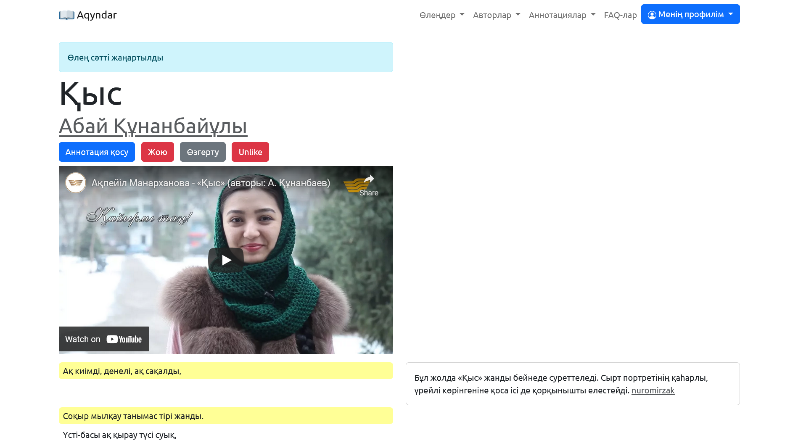
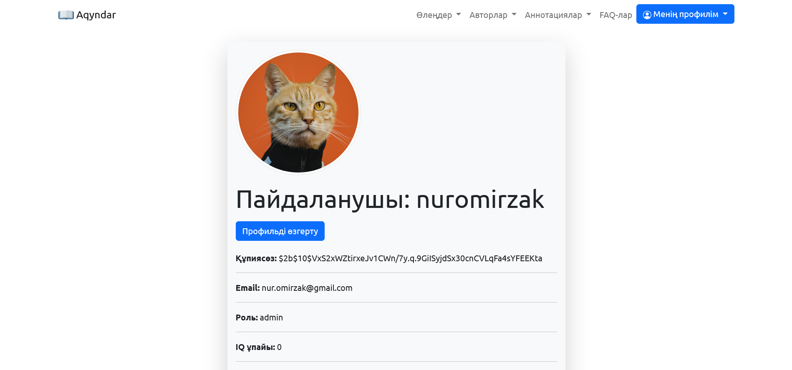
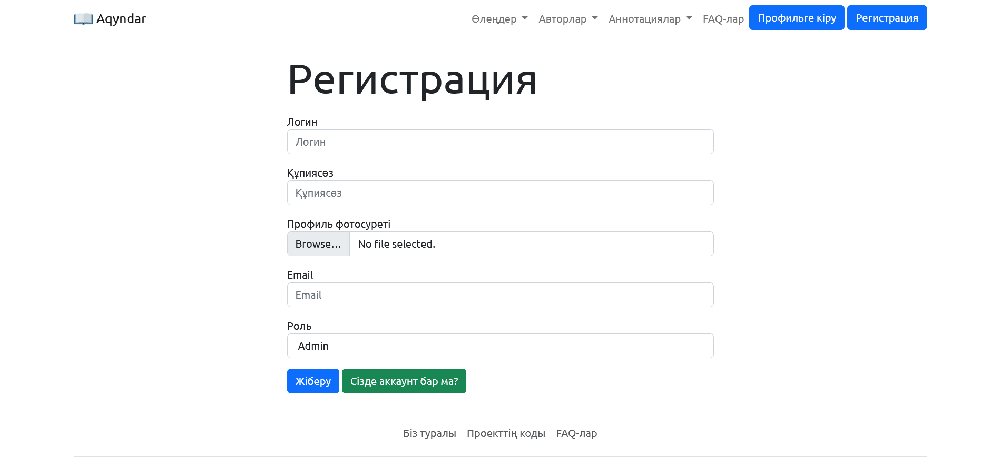

<div id="top"></div>
<!--
*** Thanks for checking out the Best-README-Template. If you have a suggestion
*** that would make this better, please fork the repo and create a pull request
*** or simply open an issue with the tag "enhancement".
*** Don't forget to give the project a star!
*** Thanks again! Now go create something AMAZING! :D
-->

<!-- https://github.com/othneildrew -->

<!-- PROJECT SHIELDS -->

<!--
*** I'm using markdown "reference style" links for readability.
*** Reference links are enclosed in brackets [ ] instead of parentheses ( ).
*** See the bottom of this document for the declaration of the reference variables
*** for contributors-url, forks-url, etc. This is an optional, concise syntax you may use.
*** https://www.markdownguide.org/basic-syntax/#reference-style-links
-->

[![Contributors][contributors-shield]][contributors-url][![Forks][forks-shield]][forks-url][![Stargazers][stars-shield]][stars-url][![Issues][issues-shield]][issues-url][![MIT License][license-shield]][license-url][![LinkedIn][linkedin-shield]][linkedin-url]

<!-- PROJECT LOGO -->

<a href="https://github.com/nuromirzak/aqyndar">
    
  </a>

# Akinder

Delivery of poems of Kazakh writers and poets in an understandable language

[Read the documentation](https://github.com/nuromirzak/aqyndar)·[Report an error](https://github.com/nuromirzak/aqyndar/issues)·[Suggest a change](https://github.com/nuromirzak/aqyndar/issues)

<!-- TABLE OF CONTENTS -->

## Content

1.  [About the project](#жоба-туралы)
    -   [Tools used](#қолданылған-құралдар)
2.  [Getting started with the project](#проектке-кірісу)
    -   [Prerequisites](#алғышарттар)
    -   [Installation](#орнату)
3.  [Add a contribution](#үлес-қосу)
4.  [License](#лицензия)
5.  [Contacts](#контакттер)

<!-- ABOUT THE PROJECT -->

## About the project

<table>
  <tr>
    <td valign="top" colspan="2"></td>
  </tr>
  <tr>
    <td valign="top"></td>
    <td valign="top"></td>
  </tr>
</table>

The purpose of this website is to convey the poems of Kazakh writers and poets to the public in an understandable language. This
the project is based on the principles of crowdsourcing. People voluntarily contribute poems/annotations to the site.

<p align="right">(<a href="#top">жоңарыға көтерілу</a>)</p>

### Tools used

-   [![Express][Express.js]][Express-url]
-   [![Mongo][MongoDB]][Mongo-url]
-   [![Bootstrap][Bootstrap.com]][Bootstrap-url]

<p align="right">(<a href="#top">жоңарыға көтерілу</a>)</p>

<!-- GETTING STARTED -->

## Getting started with the project

Проекті өзіңіздің компьютеріңізде іске қосу үшін келесі қарапайым қадамдарды орындаңыз.

### Prerequisites

This project uses the nodejs platform, so please install nodejs yourself. And, this project as a database
Uses MongoDB.

-   node

    ```sh
    npm install npm@latest -g
    ```

### Installation

1.  [Cloudinary](https://cloudinary.com/)Register on the site and get an API key

2.  Copy the repo

    ```sh
    git clone https://github.com/nuromirzak/aqyndar.git
    ```

3.  Install npm packages

    ```sh
    npm install
    ```

4.  Environment variables`.env`enter into the file

    ```dotenv
     MONGO_DB=# change to your mongodb url
     CLOUDINARY_CLOUD_NAME=# change to your cloudinary cloud name
     CLOUDINARY_KEY=# change to your cloudinary api key
     CLOUDINARY_SECRET=# change to your cloudinary secret
    ```

<p align="right">(<a href="#top">жоңарыға көтерілу</a>)</p>

<!-- CONTRIBUTING -->

## Add a contribution

Contributing makes the open-source community an amazing place to learn, be inspired, and come up with new ideas. Any
your contribution**highly appreciated**.

If you have a suggestion to improve this project, please fork the repository and open a pull request. You
You can also go to the "issues" page and submit your suggestions. Don't forget to star the project! Thank you very much!

1.  Fork the project
2.  Open "Feature" (`git checkout -b feature/AmazingFeature`)
3.  Commit changes (`git commit -m 'Add some AmazingFeature'`)
4.  Push the branch (`git push origin feature/AmazingFeature`)
5.  Open a Pull Request

<p align="right">(<a href="#top">жоңарыға көтерілу</a>)</p>

<!-- LICENSE -->

## License

Distributed under MIT license. For more information`LICENSE.txt`open the file.

<p align="right">(<a href="#top">жоңарыға көтерілу</a>)</p>

<!-- CONTACT -->

## Contacts

Nurmukhammed -[Linkedin][linkedin-url]

Link to the project:<https://github.com/nuromirzak/aqyndar>

<p align="right">(<a href="#top">жоңарыға көтерілу</a>)</p>

<!-- MARKDOWN LINKS & IMAGES -->

<!-- https://www.markdownguide.org/basic-syntax/#reference-style-links -->

[contributors-shield]: https://img.shields.io/github/contributors/nuromirzak/aqyndar.svg?style=for-the-badge

[contributors-url]: https://github.com/nuromirzak/aqyndar/graphs/contributors

[forks-shield]: https://img.shields.io/github/forks/nuromirzak/aqyndar.svg?style=for-the-badge

[forks-url]: https://github.com/nuromirzak/aqyndar/network/members

[stars-shield]: https://img.shields.io/github/stars/nuromirzak/aqyndar.svg?style=for-the-badge

[stars-url]: https://github.com/nuromirzak/aqyndar/stargazers

[issues-shield]: https://img.shields.io/github/issues/nuromirzak/aqyndar.svg?style=for-the-badge

[issues-url]: https://github.com/nuromirzak/aqyndar/issues

[license-shield]: https://img.shields.io/github/license/nuromirzak/aqyndar.svg?style=for-the-badge

[license-url]: https://github.com/nuromirzak/aqyndar/blob/master/LICENSE.txt

[linkedin-shield]: https://img.shields.io/badge/-LinkedIn-black.svg?style=for-the-badge&logo=linkedin&colorB=555

[linkedin-url]: https://linkedin.com/in/nurmukhammed

[Express.js]: https://img.shields.io/badge/Express.js-404D59?style=for-the-badge&logoColor=white&logo=express

[Express-url]: https://expressjs.com/

[MongoDB]: https://img.shields.io/badge/MongoDB-4EA94B?style=for-the-badge&logo=mongodb&logoColor=white

[Mongo-url]: https://www.mongodb.com/

[Bootstrap.com]: https://img.shields.io/badge/Bootstrap-563D7C?style=for-the-badge&logo=bootstrap&logoColor=white

[Bootstrap-url]: https://getbootstrap.com
