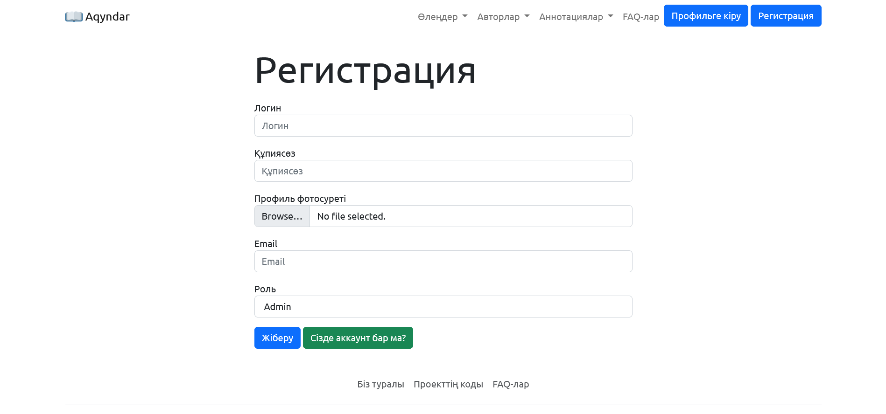

<div id="top"></div>
<!--
*** Thanks for checking out the Best-README-Template. If you have a suggestion
*** that would make this better, please fork the repo and create a pull request
*** or simply open an issue with the tag "enhancement".
*** Don't forget to give the project a star!
*** Thanks again! Now go create something AMAZING! :D
-->

<!-- https://github.com/othneildrew -->

<!-- PROJECT SHIELDS -->

<!--
*** I'm using markdown "reference style" links for readability.
*** Reference links are enclosed in brackets [ ] instead of parentheses ( ).
*** See the bottom of this document for the declaration of the reference variables
*** for contributors-url, forks-url, etc. This is an optional, concise syntax you may use.
*** https://www.markdownguide.org/basic-syntax/#reference-style-links
-->

[![Contributors][contributors-shield]][contributors-url][![Forks][forks-shield]][forks-url][![Stargazers][stars-shield]][stars-url][![Issues][issues-shield]][issues-url][![MIT License][license-shield]][license-url][![LinkedIn][linkedin-shield]][linkedin-url]

<!-- PROJECT LOGO -->

<a href="https://github.com/nuromirzak/aqyndar">
    
  </a>

# Акиндер[](./README.md)[](./README.en.md)[](./README.ru.md)

Доставка стихов казахских писателей и поэтов на понятном языке

[Читать документацию](https://github.com/nuromirzak/aqyndar)·[Сообщить об ошибке](https://github.com/nuromirzak/aqyndar/issues)·[Предложить изменение](https://github.com/nuromirzak/aqyndar/issues)

<!-- TABLE OF CONTENTS -->

## Содержание

1.  [Проект туралы](#жоба-туралы)
    -   [Используемые инструменты](#қолданылған-құралдар)
2.  [Начало работы над проектом](#проектке-кірісу)
    -   [Предпосылки](#алғышарттар)
    -   [Орнату](#орнату)
3.  [Добавить вклад](#үлес-қосу)
4.  [Лицензия](#лицензия)
5.  [Контакттер](#контакттер)

<!-- ABOUT THE PROJECT -->

## О проекте

<table>
  <tr>
    <td valign="top" colspan="2"></td>
  </tr>
  <tr>
    <td valign="top"></td>
    <td valign="top"></td>
  </tr>
</table>

Целью данного сайта является донести стихи казахских писателей и поэтов до населения на понятном языке. Этот
проект основан на принципах краудсорсинга. Люди добровольно размещают на сайте стихи/аннотации.

<p align="right">(<a href="#top">жоңарыға көтерілу</a>)</p>

### Используемые инструменты

-   [![Express][Express.js]][Express-url]
-   [![Mongo][MongoDB]][Mongo-url]
-   [![Bootstrap][Bootstrap.com]][Bootstrap-url]

<p align="right">(<a href="#top">жоңарыға көтерілу</a>)</p>

<!-- GETTING STARTED -->

## Начало работы над проектом

Проекті өзіңіздің компьютеріңізде іске қосу үшін келесі қарапайым қадамдарды орындаңыз.

### Предпосылки

В этом проекте используется платформа nodejs, поэтому установите nodejs самостоятельно. И этот проект как база данных
Использует MongoDB.

-   node

    ```sh
    npm install npm@latest -g
    ```

### Монтаж

1.  [Облачно](https://cloudinary.com/)Зарегистрируйтесь на сайте и получите API-ключ

2.  Скопируйте репо

    ```sh
    git clone https://github.com/nuromirzak/aqyndar.git
    ```

3.  Установить npm-пакеты

    ```sh
    npm install
    ```

4.  Переменные среды`.env`введите в файл

    ```dotenv
     MONGO_DB=# change to your mongodb url
     CLOUDINARY_CLOUD_NAME=# change to your cloudinary cloud name
     CLOUDINARY_KEY=# change to your cloudinary api key
     CLOUDINARY_SECRET=# change to your cloudinary secret
    ```

<p align="right">(<a href="#top">жоңарыға көтерілу</a>)</p>

<!-- CONTRIBUTING -->

## Добавить вклад

Вклад делает сообщество открытого исходного кода прекрасным местом для обучения, вдохновения и новых идей. Любой
ваш вклад**высоко ценится**.

Если у вас есть предложения по улучшению этого проекта, разветвите репозиторий и откройте запрос на извлечение. Ты
Вы также можете перейти на страницу «Вопросы» и отправить свои предложения. Не забудьте отметить проект звездочкой! Большое спасибо!

1.  Форкнуть проект
2.  Откройте «Функция» (`git checkout -b feature/AmazingFeature`)
3.  Зафиксировать изменения (`git commit -m 'Add some AmazingFeature'`)
4.  Толкнуть ветку (`git push origin feature/AmazingFeature`)
5.  Откройте запрос на слияние

<p align="right">(<a href="#top">жоңарыға көтерілу</a>)</p>

<!-- LICENSE -->

## Лицензия

Распространяется по лицензии MIT. Чтобы получить больше информации`LICENSE.txt`откройте файл.

<p align="right">(<a href="#top">жоңарыға көтерілу</a>)</p>

<!-- CONTACT -->

## Контакттер

Нурмухаммед -[Линкедин][linkedin-url]

Ссылка на проект:[хттпс://гитхов.ком/нуромирзак/акындар](https://github.com/nuromirzak/aqyndar)

<p align="right">(<a href="#top">жоңарыға көтерілу</a>)</p>

<!-- MARKDOWN LINKS & IMAGES -->

<!-- https://www.markdownguide.org/basic-syntax/#reference-style-links -->

[contributors-shield]: https://img.shields.io/github/contributors/nuromirzak/aqyndar.svg?style=for-the-badge

[contributors-url]: https://github.com/nuromirzak/aqyndar/graphs/contributors

[forks-shield]: https://img.shields.io/github/forks/nuromirzak/aqyndar.svg?style=for-the-badge

[forks-url]: https://github.com/nuromirzak/aqyndar/network/members

[stars-shield]: https://img.shields.io/github/stars/nuromirzak/aqyndar.svg?style=for-the-badge

[stars-url]: https://github.com/nuromirzak/aqyndar/stargazers

[issues-shield]: https://img.shields.io/github/issues/nuromirzak/aqyndar.svg?style=for-the-badge

[issues-url]: https://github.com/nuromirzak/aqyndar/issues

[license-shield]: https://img.shields.io/github/license/nuromirzak/aqyndar.svg?style=for-the-badge

[license-url]: https://github.com/nuromirzak/aqyndar/blob/master/LICENSE.txt

[linkedin-shield]: https://img.shields.io/badge/-LinkedIn-black.svg?style=for-the-badge&logo=linkedin&colorB=555

[linkedin-url]: https://linkedin.com/in/nurmukhammed

[Express.js]: https://img.shields.io/badge/Express.js-404D59?style=for-the-badge&logoColor=white&logo=express

[Express-url]: https://expressjs.com/

[MongoDB]: https://img.shields.io/badge/MongoDB-4EA94B?style=for-the-badge&logo=mongodb&logoColor=white

[Mongo-url]: https://www.mongodb.com/

[Bootstrap.com]: https://img.shields.io/badge/Bootstrap-563D7C?style=for-the-badge&logo=bootstrap&logoColor=white

[Bootstrap-url]: https://getbootstrap.com
